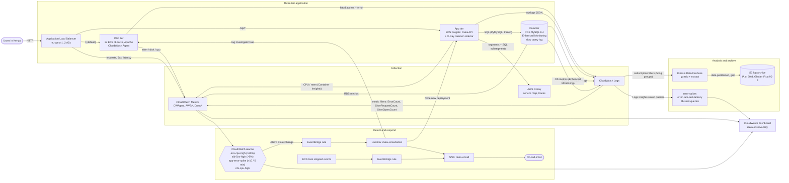

```mermaid
flowchart LR
  users([Users in Kenya]) -->|HTTP| alb["Application Load Balancer<br/>eu-west-1, 2 AZs"]

  subgraph tiers["Three-tier application"]
    alb -->|"/ (default)"| web["Web tier<br/>2x EC2 t3.micro, Apache<br/>CloudWatch Agent"]
    alb -->|"/api/*"| api["App tier<br/>ECS Fargate: Duka API<br/>+ X-Ray daemon sidecar"]
    api -->|"SQL (PyMySQL, traced)"| rds[("Data tier<br/>RDS MySQL 8.4<br/>Enhanced Monitoring<br/>slow query log")]
  end

  subgraph collect["Collection"]
    web -->|"mem / disk / cpu"| cwm["CloudWatch Metrics<br/>CWAgent, AWS/*, Duka/*"]
    web -->|"httpd access + error"| cwl["CloudWatch Logs"]
    api -->|"awslogs JSON"| cwl
    api -->|"CPU / mem (Container Insights)"| cwm
    api -->|"segments + SQL subsegments"| xray["AWS X-Ray<br/>service map, traces"]
    rds -->|"error + slowquery logs"| cwl
    rds -->|"OS metrics (Enhanced Monitoring)"| cwl
    rds -->|"RDS metrics"| cwm
    alb -->|"requests, 5xx, latency"| cwm
  end

  subgraph analyse["Analysis and archive"]
    cwl -->|"metric filters: ErrorCount, SlowRequestCount, SlowQueryCount"| cwm
    cwl -->|"Logs Insights saved queries"| insights["error-spikes<br/>error-rate-and-latency<br/>db-slow-queries"]
    cwl -->|"subscription filters (5 log groups)"| fh["Kinesis Data Firehose<br/>gunzip + extract"]
    fh -->|"date-partitioned, gzip"| s3[("S3 log archive<br/>IA at 30 d, Glacier IR at 90 d")]
  end

  subgraph respond["Detect and respond"]
    cwm --> alarms{{"CloudWatch alarms<br/>ecs-cpu-high (&gt;80%)<br/>alb-5xx-high (&gt;5%)<br/>app-error-spike (&gt;10 / 5 min)<br/>rds-cpu-high"}}
    alarms -->|"Alarm State Change"| eb["EventBridge rule"]
    eb --> lambda["Lambda: duka-remediation"]
    lambda -->|"force new deployment"| api
    lambda -->|"tag investigate=true"| web
    lambda --> sns["SNS: duka-oncall"] --> oncall([On-call email])
    ecsev["ECS task stopped events"] --> eb2["EventBridge rule"] --> sns
  end

  cwm --> dash["CloudWatch dashboard<br/>duka-observability"]
  alarms --> dash
  insights --> dash
```
